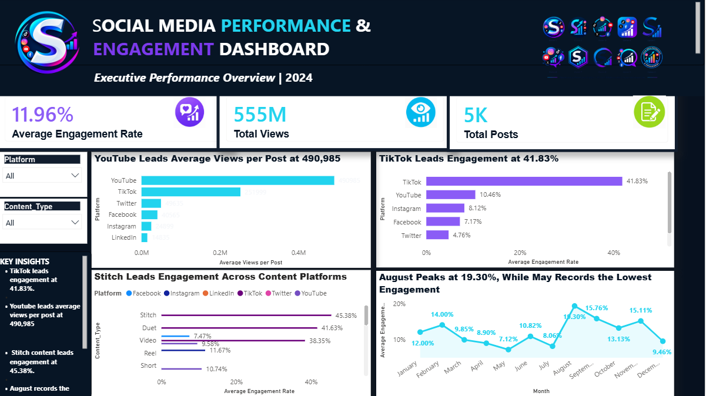
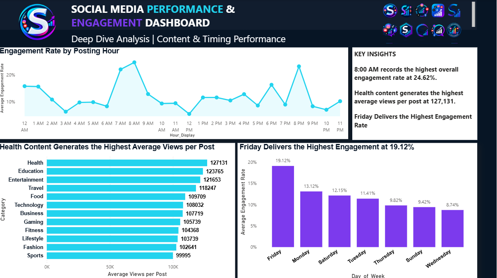

# 📊 Social Media Performance & Engagement Dashboard

An interactive Power BI dashboard designed to analyze social media performance, engagement, content effectiveness, posting patterns, and platform performance across 2024.

The dashboard transforms social media data into actionable insights that can support content planning, platform strategy, and data-driven decision-making.

---

## 📌 Project Overview

Social media platforms generate large volumes of data that can be used to understand audience engagement and content performance.

This project analyzes social media performance across multiple platforms, content types, categories, posting hours, days of the week, and monthly periods.

The dashboard consists of two interactive pages:

1. **Executive Performance Overview**
2. **Deep Dive Analysis | Content & Timing Performance**

The analysis provides both a high-level executive view and a deeper exploration of the factors influencing social media engagement.

---

## 🎯 Project Objectives

- Evaluate overall social media performance.
- Compare engagement rates across social media platforms.
- Identify platforms generating the highest average views per post.
- Analyze engagement performance across different content types.
- Identify high-performing content categories.
- Determine the posting hours associated with higher engagement.
- Compare engagement performance across days of the week.
- Examine monthly engagement trends.
- Generate actionable insights to support social media strategy.

---

## 🛠️ Tools & Technologies

- **Power BI** – Dashboard development and interactive visualization
- **DAX** – Measures and analytical calculations
- **Microsoft Excel** – Data preparation and source data management
- **Data Cleaning & Transformation** – Preparing data for analysis
- **Data Visualization** – Presenting trends and performance insights

---

## 📈 Key Performance Indicators

| KPI | Result |
|---|---:|
| Average Engagement Rate | **11.96%** |
| Total Views | **555M** |
| Total Posts | **5K** |

---

# 📊 Dashboard Pages

## 1. Executive Performance Overview

The Executive Performance Overview provides a high-level summary of social media performance across platforms and content types.

### Key Visualizations

- Average views per post by platform
- Engagement rate by platform
- Engagement rate by content type
- Monthly engagement trends
- Overall performance KPIs
- Interactive Platform filter
- Interactive Content Type filter

### Key Insights

- **TikTok** recorded the highest engagement rate at **41.83%**.
- **YouTube** recorded the highest average views per post at approximately **490,985**.
- **Stitch** content recorded the highest engagement rate among the analyzed content types at **45.38%**.
- Monthly engagement peaked in **August at 19.30%**.
- **May** recorded the lowest monthly engagement rate at **7.12%**.

---

## 2. Deep Dive Analysis | Content & Timing Performance

The second dashboard page investigates how posting time, content category, and day of the week relate to social media performance.

### Key Visualizations

- Engagement rate by posting hour
- Average views per post by content category
- Engagement rate by day of the week
- Performance highlights and key insights

### Key Insights

- **8:00 AM** recorded the highest overall engagement rate at **24.62%**.
- **Health** content generated the highest average views per post at **127,131**.
- **Friday** recorded the highest engagement rate among the analyzed days at **19.12%**.
- The analysis demonstrates that both content category and posting timing can influence social media performance.

---

# 🔍 Key Findings

The analysis revealed several important performance patterns:

### 🚀 Platform Performance

TikTok demonstrated the strongest engagement performance, recording an engagement rate of **41.83%**, while YouTube achieved the highest average views per post.

### 🎬 Content Performance

Stitch content recorded the highest engagement rate at **45.38%**, indicating strong audience interaction with this content format.

### 🕗 Posting Time

Engagement varied considerably across posting hours, with **8:00 AM** recording the highest observed engagement rate of **24.62%**.

### 📅 Day-of-Week Performance

Friday achieved the highest engagement rate among the days analyzed at **19.12%**.

### 📆 Monthly Performance

Engagement reached its highest point in **August at 19.30%**, while May recorded the lowest at **7.12%**.

---

# 💡 Business Recommendations

Based on the dashboard findings:

- Prioritize high-performing platforms such as TikTok when the objective is to maximize audience engagement.
- Consider YouTube for content strategies focused on generating higher views per post.
- Increase experimentation with high-performing content formats such as Stitch.
- Test and optimize publishing schedules around high-performing posting periods, particularly around **8:00 AM**.
- Leverage high-performing days such as Friday when planning important campaigns or engagement-focused content.
- Monitor monthly performance trends to identify changes in audience behavior and optimize future content strategies.
- Continue testing different content categories to determine which topics generate the strongest combination of reach and engagement.

---

# 📸 Dashboard Preview

## Executive Performance Overview

## Deep Dive Analysis

---

# 📁 Project Files

| File | Description |
|---|---|
| `Social_Media_Performance_Engagement_Dashboard.pbix` | Interactive Power BI dashboard |
| `executive-overview.png` | Executive Performance Overview screenshot |
| `deep-dive-analysis.png` | Deep Dive Analysis screenshot |

---

# 📊 Dashboard Highlights

**555M**  
Total Views

**5K**  
Total Posts

**11.96%**  
Average Engagement Rate

**41.83%**  
Highest Platform Engagement

**490,985**  
Highest Average Views per Post

**24.62%**  
Highest Engagement by Posting Hour

---

# 👩🏽‍💻 Author

### Grace Oluwapelumi Akanle

**Data Analyst | Power BI | Excel | SQL | Data Visualization**

Passionate about transforming data into meaningful insights and building interactive dashboards that support better business decisions.

---

## ⭐ If you found this project useful, feel free to explore the repository and connect with me.
